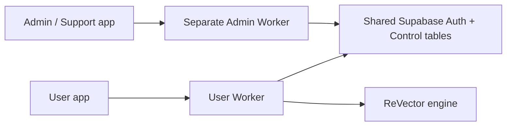

# ReVector Admin / Support Console

Standalone operations application extracted from `RevectorAi-WEB` commit
`7c89e6ffb0cd848d0e645e67ccddd96f94691939`. This repository contains the
administration/support interface and its own Cloudflare Worker. It contains no
vector engine, raster processing, normal user dashboard or engine proxy.

The user application remains in https://github.com/nafiulnahid17/RevectorAi-WEB.
The engine remains unchanged in https://github.com/nafiulnahid17/RevectorAI-Tool.



## Interfaces and authorization

- `/` redirects to `/admin/login`.
- `/admin/login` is the public, standalone sign-in screen.
- `/admin` and `/admin/{overview,users,wallets,credits,usage,models,support,audit,settings}`
  require an explicitly authorized operations session before serving assets.
- ADMIN may manage global operations. SUPPORT can only enter the Support Inbox
  and read/reply to support tickets. USER is rejected by the login and APIs.
- `/api/account/*`, `/api/auth/*` and `/api/revector/*` do not exist here.
- The normal user app no longer serves `/admin/*` or `/api/admin/*`.

The HttpOnly, Secure-on-HTTPS, SameSite=Lax operations cookie is AES-GCM encrypted
and bound to its host origin and cookie name. Deploy on a separate hostname with
a separate SESSION_SIGNING_KEY; user cookies cannot grant operations access.
Every API request verifies the Supabase Auth user and current active database role.
JWT metadata, client role fields and hidden buttons provide no authorization.
The service-role key never enters static assets or browser JavaScript.

Wallet changes and approvals execute the existing reviewed SQL RPCs, preserving
row locks, append-only ledgers/audit logs, required reasons and idempotency.
Logout invalidates the account's ReVector sessions; this can also sign out another
application session belonging to the same Auth account.

## Local setup

```bash
npm ci
npm run check
npm test
npm run build
cp .dev.vars.example .dev.vars
# Set local server-side configuration securely; never commit .dev.vars.
npm run dev
```

Local URL: `http://127.0.0.1:8788/admin/login`. Without Supabase configuration,
the interface honestly reports account services unavailable. No test user or
administrator is automatically created. Invite/provision authorized operators
through the trusted owner workflow.

## Database contract

Use the same intended Supabase project and reviewed ReVector control schema as
the user application. The authoritative migration is in the WEB repository:
`supabase/migrations/20261004190643_revector_control_v1.sql`.

`schema/20261004190643_revector_control_v1.sql` is an identical, versioned contract
snapshot for standalone PostgreSQL regression tests. **Do not apply it a second
time when the WEB migration has already been applied.** This application does not
automatically modify database tables, migrate production or provision roles.
Coordinate future schema changes across both repositories.

Required server-side configuration names:

- SUPABASE_URL
- SUPABASE_ANON_KEY
- SUPABASE_SERVICE_ROLE_KEY
- SESSION_SIGNING_KEY (separate from the user application)
- CREDITS_PER_USD (optional reporting value; keep consistent with the approved user billing configuration)

No ENGINE_API_KEY, Cloudflare AI token or OpenAI key is needed by this console.
Supabase service credentials and signing key must be Worker secrets. Pricing
preferences remain advisory; this console cannot change engine infrastructure.

## API contract

List responses are `{items:[...]}`, with validated `offset` and a 50-row page.
Mutations require the same-origin `Origin` header. JSON and provider responses
are bounded to 1 MiB; Supabase requests use HTTPS, finite timeouts and no redirects.
Unknown or internal credential/SQL failures return safe structured errors.

| API | Access / purpose |
| --- | --- |
| GET /health | Worker availability, not database/provider readiness |
| GET /api/admin/bootstrap | Configuration boolean only |
| POST /api/admin/auth/login | Authorized ADMIN/SUPPORT password sign-in |
| POST /api/admin/auth/logout | Auth/session invalidation |
| GET /api/admin/session | Own verified operations profile |
| GET /api/admin/overview | ADMIN measured operational aggregates |
| GET /api/admin/users, wallets, transactions, usage, requests, audit, models | ADMIN global lists |
| POST /api/admin/wallet/adjust | ADMIN: user_id, delta, reason, idempotency_key UUID |
| POST /api/admin/requests/decide | ADMIN: request_id, APPROVED/REJECTED/REPLY, response, idempotency_key; optional model_id |
| POST /api/admin/users/status | ADMIN: audited status and reason |
| GET /api/admin/support | ADMIN/SUPPORT ticket inbox |
| GET /api/admin/support/messages?request_id=UUID | ADMIN/SUPPORT private ticket conversation |
| POST /api/admin/support/reply | ADMIN/SUPPORT: request_id, message, status |
| GET /api/admin/settings | ADMIN safe control configuration |
| POST /api/admin/models/update | ADMIN catalog availability/pricing with required reason |

Unknown action IDs/routes are unavailable. Operations never silently overwrite
wallet balances, fabricate invoices, enable an AI model merely because it is
preferred, or alter Railway/Cloudflare infrastructure.

## Tests and future deployment

```bash
npm test
npx playwright install chromium
npm run test:browser
```

Browser fixtures are explicitly TEST_ONLY. PostgreSQL tests execute the real
schema/RLS/ledger logic via PGlite. Tests cover role freshness, origin-bound
cookies, cross-origin mutations, excluded user/engine APIs, top-up/model approvals,
wallet adjustment, support replies and desktop/mobile layouts.

GitHub Actions performs verification only; it does not deploy. When deployment
is separately authorized, publish this repository as the `revectorai-support`
Worker on its own hostname, configure the names above securely, then verify a
real authorized login and ticket reply. The user site remains `revectorai-web`.
Do not put credentials into workflow YAML or frontend files.
